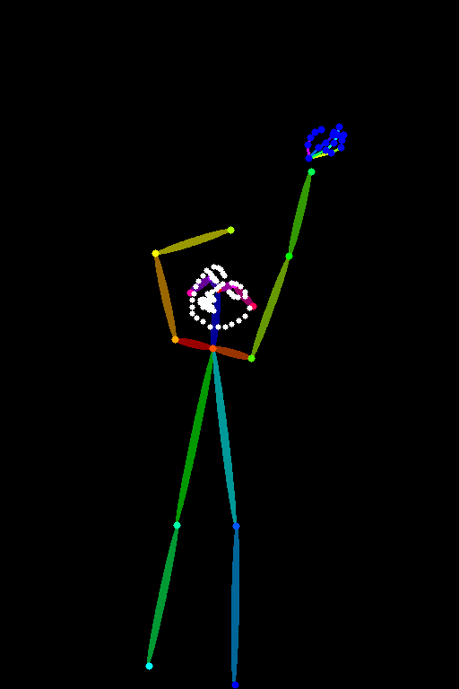
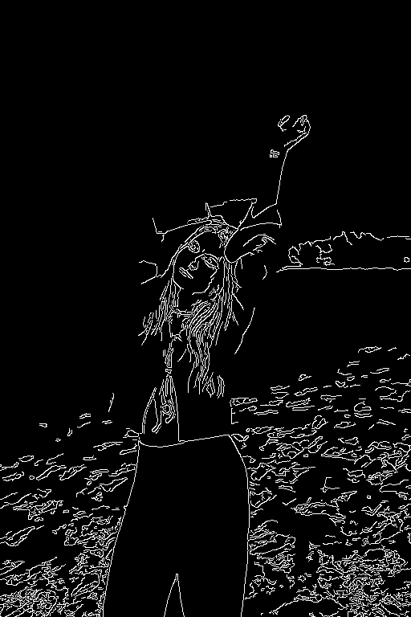
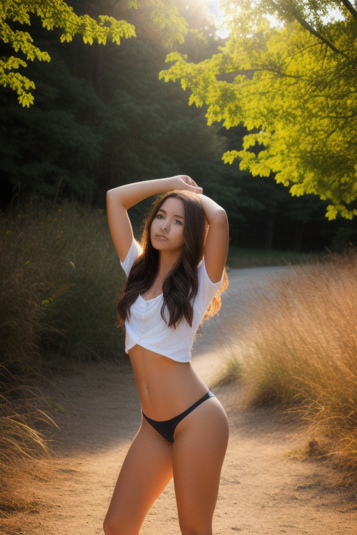

# 2화 Reference 이미지 교체 프리뷰

기존 저작권 문제가 있던 reference.jpg를 Unsplash 무료 이미지로 교체하고, 관련 이미지 14개를 전부 재생성한 결과.

Source: https://unsplash.com/photos/wRiVI9B1bek (Unsplash License)

## 참조 사진 vs ControlNet 결과

| 참조 사진 | txt2img | OpenPose |
|:---:|:---:|:---:|
|  |  |  |

## 전처리 맵

| OpenPose | Canny | Depth |
|:---:|:---:|:---:|
|  |  |  |

## ControlNet 비교 (OpenPose / Canny / Depth)

| 참조 사진 | OpenPose | Canny | Depth |
|:---:|:---:|:---:|:---:|
|  |  |  |  |

## Strength 비교

| 0.3 | 1.0 | 1.5 | 1.8 |
|:---:|:---:|:---:|:---:|
|  |  |  |  |

## End Percent 비교

| 0.3 | 0.8 | 1.0 |
|:---:|:---:|:---:|
|  |  |  |
