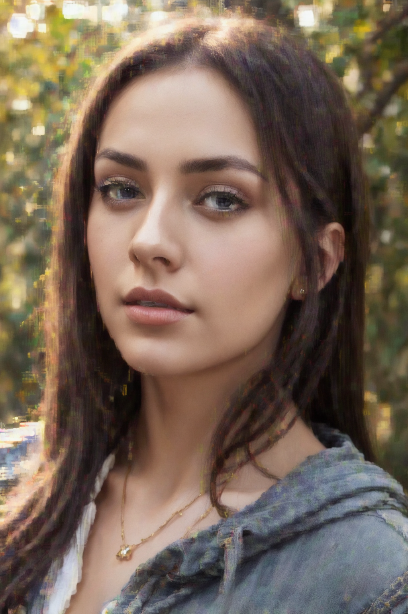
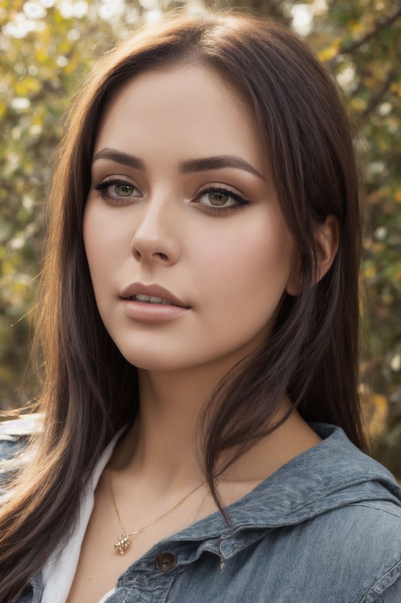
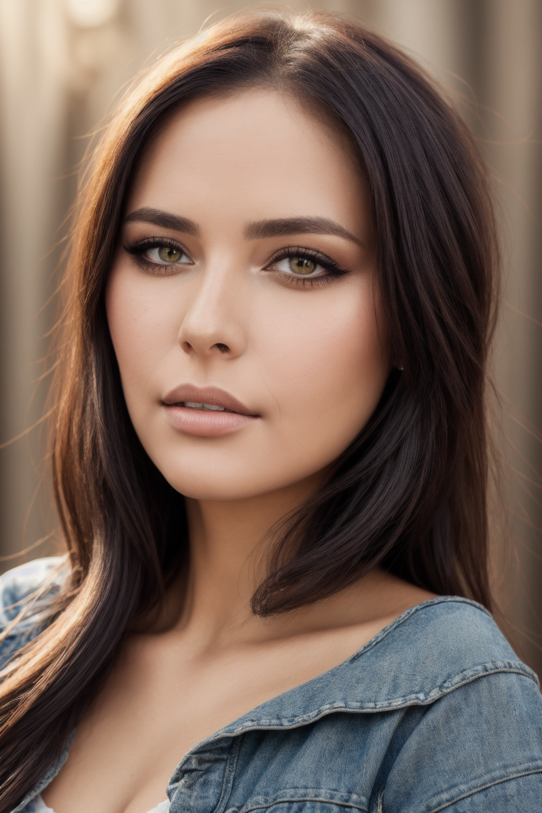
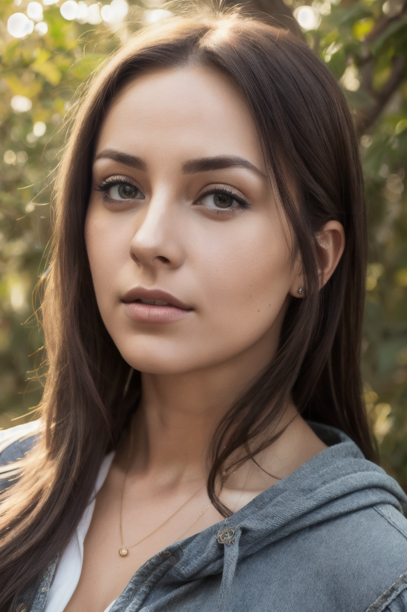
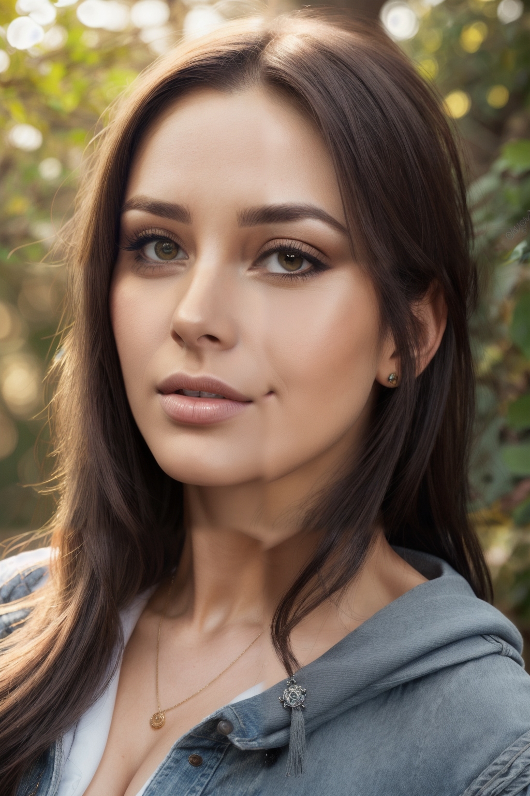
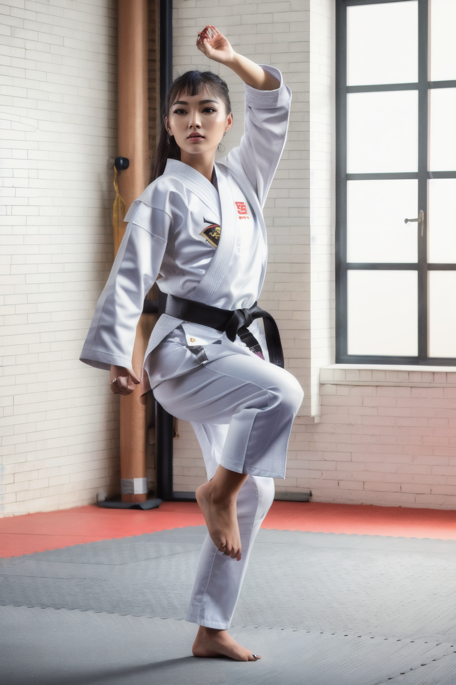

# 4화. 해상도 — 업스케일링

*AI 이미지 생성 실전 가이드 | 사진 한 장을 완성하기까지*

---

## 들어가며

3화까지 얼굴 보정을 끝냈지만, 근본적인 문제가 남아있다. 해상도가 512x768이다.

이 크기는 SD 1.5의 학습 해상도에 맞춘 것으로, 생성 품질은 괜찮지만 실제로 쓰기엔 작다. 화면에서 보면 작고, 인쇄하면 흐리고, 크롭하면 픽셀이 보인다. 512x768은 약 39만 픽셀인데, 일반적인 스마트폰 사진은 1200만 픽셀 이상이다. 30배 차이다.

그렇다면 처음부터 큰 해상도로 생성하면 되지 않을까? 안 된다. SD 1.5는 512x512(또는 512x768)로 학습됐기 때문에, 1024x1536 같은 큰 해상도를 직접 생성하면 구도가 이상해진다. 인물이 두 명 나오거나, 머리가 잘리거나, 비율이 뒤틀린다. 1화에서 겪었던 문제다.

해결 방법은 **업스케일링**이다. 512x768로 생성한 뒤, 해상도를 올린다.


## 업스케일링의 세 가지 방법

크게 세 가지 접근이 있다.

**1. 이미지 업스케일러 (단순 확대)**
전통적인 이미지 확대 알고리즘이다. Lanczos, Bicubic 같은 보간법이나, ESRGAN 계열의 AI 업스케일러가 여기에 해당한다. Stable Diffusion과 무관하게 작동하며, 이미지의 해상도만 올린다. 새로운 디테일을 "만들어내지"는 않고, 기존 정보를 최대한 살려서 확대한다.

**2. Hires Fix (잠재 공간 업스케일)**
이미지를 잠재 공간(latent space)에서 확대하고, KSampler로 다시 디노이징한다. Stable Diffusion이 확대된 영역에 새로운 디테일을 그려넣는다. 디테일이 추가되지만, denoise가 높으면 원본과 달라질 수 있다.

**3. 타일 기반 업스케일 (Ultimate SD Upscale)**
이미지를 작은 타일로 나누고, 각 타일을 개별적으로 인페인팅하듯 처리한다. 타일마다 SD가 디테일을 추가하므로 VRAM 부담 없이 큰 이미지를 만들 수 있다. 실전에서 가장 많이 쓰이는 방법이다.


## 방법 1: 이미지 업스케일러

### 보간법 vs AI 업스케일러

가장 단순한 방법은 이미지 자체를 확대하는 것이다. Photoshop에서 이미지 크기를 키우는 것과 같은 원리다.

ComfyUI에는 두 종류의 업스케일 노드가 있다.

**ImageScale** (보간법):
Lanczos, Bicubic, Nearest-neighbor 등 전통적인 보간법을 사용한다. 빠르지만, 확대할수록 흐려진다. 원본에 없는 디테일을 추가하지 않는다.

**ImageUpscaleWithModel** (AI 업스케일러):
ESRGAN 계열의 학습된 모델을 사용한다. 보간법보다 선명하고, 텍스처와 에지를 살려준다. 4x-UltraSharp, RealESRGAN_x4plus 등이 대표적이다.

| Lanczos (보간법) | RealESRGAN | 4x-UltraSharp |
|:---:|:---:|:---:|
|  |  |  |

> **설정**: 원본 512x768 → 4x 업스케일 2048x3072

Lanczos는 깔끔하지만 디테일이 없다. 확대해보면 피부가 밋밋하고 머리카락이 뭉개져 있다. RealESRGAN은 텍스처를 살리지만 약간의 아티팩트가 있을 수 있다. 4x-UltraSharp는 실사 이미지에 가장 적합하다는 평가를 받는다.

### 워크플로

```
[이미지 로드] → [UpscaleModelLoader] → [ImageUpscaleWithModel] → [저장]
```

단순하다. 모델을 로드하고, 이미지를 넣으면 끝이다. KSampler가 없으므로 **체크포인트도 프롬프트도 필요 없다.** 처리 속도도 빠르다 — SD 생성 없이 업스케일 모델만 돌리기 때문에 수 초면 된다.

### 한계

이미지 업스케일러는 "있는 것을 선명하게"하는 도구다. 원본에 디테일이 없으면 업스케일해도 디테일이 생기지 않는다. 512x768에서 뭉개진 눈은 2048x3072로 키워도 뭉개진 채로 선명해질 뿐이다. 선명한 흐림이다.

실전에서 이미지 업스케일러만 단독으로 쓰는 경우는 드물다. 보통 Hires Fix나 타일 업스케일의 전처리 단계로 사용한다.


## 방법 2: Hires Fix

### 원리

Hires Fix는 Automatic1111에서 유래한 용어지만, ComfyUI에서도 같은 원리를 구현할 수 있다. 핵심은 **잠재 공간에서 확대 → 재디노이징**이다.

1. 원본 이미지를 VAE로 인코딩한다 (잠재 공간으로)
2. 잠재 표현을 업스케일한다 (2x)
3. KSampler로 다시 디노이징한다
4. VAE로 디코딩한다

3번이 핵심이다. 확대된 잠재 공간에서 KSampler가 돌면서, 원본에 없던 디테일을 Stable Diffusion이 "그려넣는다." 피부 질감, 머리카락 가닥, 의상 패턴 등이 추가된다.

### 워크플로

```
[이미지 로드] → [VAE 인코드] → [LatentUpscale 2x] → [KSampler] → [VAE 디코드] → [저장]
[체크포인트 로드] → [프롬프트] ───────────────────────┘
```

### Denoise가 관건

인페인팅과 마찬가지로, denoise strength가 결과를 결정한다.

| 원본 (512x768) | Denoise 0.3 | Denoise 0.5 | Denoise 0.7 |
|:---:|:---:|:---:|:---:|
|  |  |  |  |

> **설정**: Realistic Vision V5.1 | 1024x1536 (2x) | DPM++ SDE Karras | Steps 20 | CFG 7.0 | Seed 42

0.3에서는 원본의 구도와 외형이 유지되지만, 잠재 공간 업스케일 특유의 격자 아티팩트가 나타날 수 있다. 피부, 배경 보케, 머리카락에 걸쳐 일관된 크로스해치 패턴이 보인다면 이 문제다. 0.5에서는 아티팩트가 줄면서 디테일이 추가되고, 0.7에서는 구도는 유지되지만 인물이 상당히 달라질 수 있다.

**Hires Fix의 실용적 denoise 범위는 0.4~0.5다.** 0.3 이하는 잠재 공간 아티팩트가 남고, 0.6 이상은 원본과 동떨어진다.

### 한계

Hires Fix는 전체 이미지를 한 번에 처리한다. 1024x1536은 SD 1.5의 학습 해상도보다 크기 때문에, VRAM 사용량이 크게 늘어난다. 2048x3072 같은 4x 업스케일은 VRAM 부족으로 실패할 가능성이 높다.

또한 전체 이미지를 한 번에 디노이징하므로, 이미지 크기가 커질수록 품질이 떨어지거나 구도가 흐트러질 수 있다. SD 1.5가 큰 해상도에서 생성하면 나타나는 문제(인물 중복, 비율 왜곡)가 여기서도 발생한다.


## 방법 3: Ultimate SD Upscale

### 원리

Ultimate SD Upscale은 이미지를 작은 타일로 나누고, 각 타일을 개별적으로 처리하는 방식이다.

1. 이미지를 업스케일 모델(4x-UltraSharp 등)로 먼저 확대한다
2. 확대된 이미지를 타일 크기(예: 512x512)로 분할한다
3. 각 타일을 KSampler로 저강도 디노이징한다
4. 타일을 다시 합쳐서 최종 이미지를 만든다

핵심은 **타일 단위 처리**다. 각 타일은 512x512이므로 SD 1.5의 학습 해상도에 딱 맞고, VRAM 부담도 타일 하나 분량이다. 2048x3072든 4096x6144든, 타일 크기만 일정하면 VRAM 사용량은 같다.

### 설치

ComfyUI에서 Ultimate SD Upscale을 사용하려면:

```bash
cd ComfyUI/custom_nodes/
git clone https://github.com/ssitu/ComfyUI_UltimateSDUpscale.git
```

ComfyUI를 재시작하면 `UltimateSDUpscale` 노드가 추가된다.

### 워크플로

```
[이미지 로드] ─────────────────────────────────┐
[UpscaleModelLoader] ──────────────────────────→ [UltimateSDUpscale] → [저장]
[체크포인트 로드] → [프롬프트] ─────────────────┘
```

UltimateSDUpscale 노드 하나에 업스케일 모델, KSampler 설정, 타일 크기가 전부 들어간다.

### 주요 파라미터

| 파라미터 | 권장값 | 설명 |
|---------|--------|------|
| upscale_by | 2.0 | 확대 배율. 2x면 512x768 → 1024x1536 |
| tile_width | 512 | 타일 가로 크기. SD 1.5 학습 해상도에 맞춤 |
| tile_height | 512 | 타일 세로 크기 |
| tile_padding | 32~64 | 타일 겹침 영역. 이음새를 줄인다 |
| denoise | 0.2~0.4 | 타일별 디노이징 강도 |
| mode_type | Linear | 타일 경계 블렌딩 방식 |

**denoise**가 여기서도 핵심이다. 타일별로 디노이징하기 때문에, 값이 높으면 타일마다 다른 스타일이 적용되어 이음새가 보인다. **0.2~0.3이 안전한 범위다.**

### Denoise 비교

| 원본 (512x768) | Denoise 0.3 | Denoise 0.5 |
|:---:|:---:|:---:|
|  |  |  |

> **설정**: 4x-UltraSharp | 2x 업스케일 (1024x1536) | tile 512x512 | DPM++ SDE Karras | Steps 20 | CFG 7.0 | Seed 42

0.3에서는 원본 느낌을 유지하면서 디테일이 추가된다. 0.5에서는 디테일이 더 풍부해지지만, 타일 경계에서 미세한 차이가 보일 수 있다.


## 세 방법 비교

| | 이미지 업스케일러 | Hires Fix | Ultimate SD Upscale |
|---|---|---|---|
| 새 디테일 | 추가 안 됨 | 추가됨 | 추가됨 |
| VRAM 사용 | 적음 | 많음 | 적음 (타일 단위) |
| 처리 시간 | 빠름 | 보통 | 느림 (타일 수만큼) |
| 최대 해상도 | 제한 없음 | VRAM 한계 | 제한 없음 |
| 원본 유지 | 높음 | 중간 | 중간 |
| 이음새 | 없음 | 없음 | 가능 (denoise 높으면) |
| 적합한 상황 | 전처리, 빠른 확대 | 2x 업스케일 | 고해상도 최종 출력 |

실전에서는 **Ultimate SD Upscale이 가장 범용적**이다. VRAM 제한 없이 원하는 크기로 업스케일할 수 있고, 타일 단위로 디테일을 추가한다. 다만 타일이 많으면 시간이 오래 걸린다.

빠르게 2x만 올리고 싶으면 Hires Fix도 좋다. 이미지 업스케일러는 단독으로 쓰기보다, 다른 방법의 전처리로 활용하는 것이 보통이다.


## 삽질 기록

### SD 1.5 학습 해상도를 넘기면 생기는 일

처음에 "그냥 1024x1536으로 생성하면 되지 않나?"라고 생각했다. 결과는 참담했다. 인물이 두 명 나오거나, 얼굴이 두 개이거나, 몸이 잘려있었다. SD 1.5가 512x512(또는 가로세로 비율이 비슷한 범위)로 학습됐기 때문에, 큰 캔버스를 채우는 방법을 모른다.

업스케일링은 이 문제를 우회한다. 512x768에서 올바른 구도로 생성하고, 그 다음에 해상도를 올린다.

### Hires Fix의 격자 아티팩트

Hires Fix에서 denoise를 0.3으로 낮추면, 이미지 전체에 격자(크로스해치) 패턴이 나타났다. 피부, 머리카락은 물론이고 배경 보케에도 동일한 패턴이 보인다. 잠재 공간에서 업스케일할 때 보간이 만드는 구조를 KSampler가 충분히 제거하지 못해서 생기는 현상이다.

denoise를 0.5 이상으로 올리면 KSampler가 잠재 공간을 충분히 재처리하면서 아티팩트가 사라진다. 대신 원본과 달라지는 정도가 커진다. Hires Fix를 쓸 거라면 denoise 0.4~0.5 사이에서 균형점을 찾아야 한다.

### 타일 이음새

Ultimate SD Upscale에서 denoise를 0.5 이상으로 올리면, 타일마다 SD가 다른 해석을 하면서 격자 모양의 이음새가 보인다. tile_padding을 64로 늘리면 완화되지만, 근본적으로는 denoise를 낮추는 것이 답이다.

### 업스케일 순서의 중요성

"먼저 업스케일하고 FaceDetailer?" vs "FaceDetailer 먼저 하고 업스케일?"

FaceDetailer를 먼저 하는 것이 낫다. FaceDetailer는 작은 얼굴을 크롭해서 확대 처리하는 노드인데, 업스케일 후에 실행하면 이미 얼굴이 충분히 크므로 크롭의 이점이 줄어든다. 오히려 업스케일로 생긴 아티팩트까지 포함해서 처리하게 된다.

권장 순서: txt2img → ControlNet → FaceDetailer → **업스케일**

### Hires Fix의 VRAM 문제

16GB VRAM에서 Hires Fix 2x(1024x1536)는 돌아간다. 하지만 3x(1536x2304)는 OOM이 났다. SD 1.5 기준으로 16GB에서 Hires Fix의 현실적 한계는 2x다. 그 이상은 Ultimate SD Upscale을 쓰는 것이 안전하다.


## 시리즈 작업물: 업스케일링

3화에서 FaceDetailer로 얼굴을 보정한 학다리 자세 결과물을 업스케일했다.

> **Ultimate SD Upscale 설정**: 4x-UltraSharp | 2x (1024x1536) | tile 512x512 | denoise 0.3 | DPM++ SDE Karras | Steps 20 | CFG 7.0 | Seed 42

| 3화 결과 (FaceDetailer, 512x768) | 4화 결과 (업스케일, 1024x1536) |
|:---:|:---:|
|  |  |

1화부터의 진행 비교:

| 1화 (txt2img) | 2화 (OpenPose + Canny 조합) | 3화 (FaceDetailer) | 4화 (업스케일) |
|:---:|:---:|:---:|:---:|
|  |  |  |  |

1화에서 프롬프트만으로 시작해, 2화에서 포즈를 잡고, 3화에서 얼굴을 보정하고, 4화에서 해상도를 올렸다. 512x768에서 1024x1536으로 2배가 됐다. 확대해보면 피부 질감, 의상 디테일, 배경의 선명도가 확연히 다르다.

아직 남은 과제가 있다. 손과 발의 디테일, 특정 의상이나 소품의 정확성 같은 문제다. 다음에는 LoRA나 추가 후처리로 세부 디테일을 개선하는 방법을 다뤄볼 생각이다.


## 정리

4화에서 배운 것:

- SD 1.5는 학습 해상도(512x768)를 넘기면 구도가 깨진다. **업스케일링**으로 우회한다
- **이미지 업스케일러**(4x-UltraSharp 등)는 빠르지만 새 디테일을 추가하지 않는다
- **Hires Fix**는 잠재 공간에서 확대 후 재디노이징한다. 2x까지 실용적
- **Ultimate SD Upscale**은 타일 단위로 처리해서 VRAM 제한 없이 큰 이미지를 만든다
- 업스케일 시 denoise는 **0.2~0.4**가 안전하다. 높으면 원본이 변하거나 이음새가 생긴다
- 권장 파이프라인 순서: txt2img → ControlNet → FaceDetailer → **업스케일**
- 실전에서는 **Ultimate SD Upscale**이 가장 범용적이다

---

*이전: [3화. 얼굴 — 인페인팅과 FaceDetailer](../ai-image-guide-03/README.md)*
